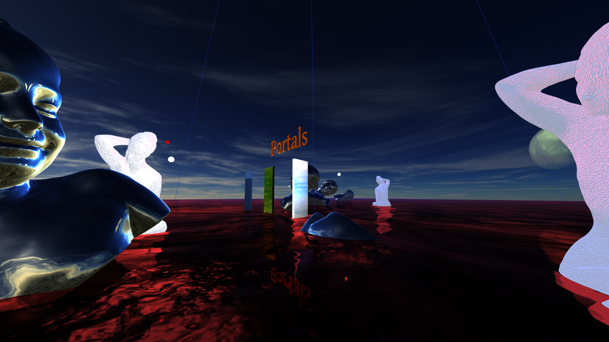
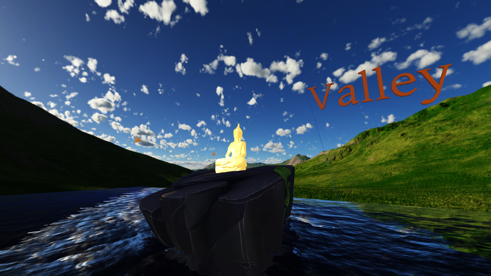
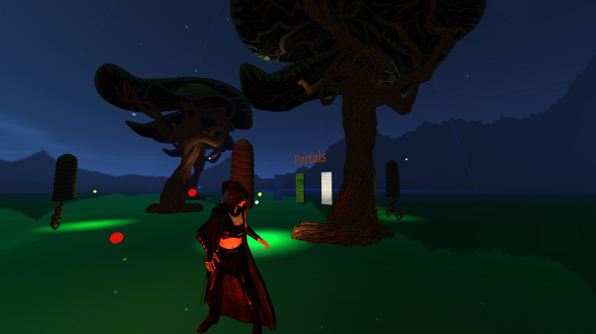

# PortalsAndLevels

<h2>Deployment:</h2>
	https://code.visualstudio.com

Use this site to download Visual Studio Code and then install the Live Server extension

	Use Visual Studio Code live server extension to launch live server after opening the root directory in Visual Studio Code

Implementation and Characteristics:

	A 3d world has been created and textures have been used to setup skybox for the scene

	Created 3 portals to 3 worlds using a form of collision detection using intersect function of Raycaster in three.js between the camera and the portal box geometries.

	Created a movement system for the user along with several other key inputs that can be used to make changes throughout the scenes  

<h2>Scene Forest</h2>

o	A basic plane geometry created to hold the scene. The plane has been mapped with different textures which can be toggled and changed. Environment maps, bump maps and normal maps have been used

o	Created a chunk of big tree and small tree models using FBX loader and they are randomly positioned everytime the application is opened

o	Implemented lights which move around the trees

o	Implemeted a 3d character in the scene along with lights around it

<h2>Scene Valley</h2>

o	Implemented a plane to hold the scene, implemented a plane geometry with water texture to create a lake

o	Implemented model of Buddha on a rock and a model of girl swimming along with 3 lights which move around the Buddha and rotating tetrahedron geometries with lights which move around the scene like birds based on sin and cos values

o	Implemented valley skybox, textured buddha model and created movement for the swimmer, along with camera following the flying lights. 

<h2>Scene RedLake</h2>

o	Implemented a plane to hold the scene, implemented a plane geometry with water texture to create a lake

o	Implemented chunks of models throughout the scene with lights moving around them

o	The statue model has been bump mapped and the girl head model has been environment mapped, along with a floating like animation. 

o	Models can also be rotated

<h2>User Manual:</h2>

	Move Around: W, A, S, D

	Move Up: Space

	Move Down: Ctrl

	Look Around: Use Mouse

	Set Camera to Origin: P

	Esc: Home Screen

Scene Forest:

	Toggle Vertex Colors for the Floor: F

	Change Texture of Floor: G

	Add/Remove Bump Map: H

	Toggle Big Tree Lights: T

	Toggle Other Lights: Y

Scene Valley:

	Toggle Follow a Flying Light: K

	Next Flying Light: G

	Remove Rock: O

	Pause Flying Lights: V

	Toggle Buddha Lights: I

	Move Swimmer: Hold M

Scene RedLake:

	Rotate Objects: Hold R

	Toggle Statue Lights: Z

	Toggle Girl Lights: Y

<h2>Acknowledgement:</h2>

I have listed the sources I have taken help from:
	Code
	
	https://threejs.org

	https://threejs.org/examples/?q=controls#misc_controls_pointerlock

Taken reference to setup the initial movement and scene but it has been updated and not using the jump operation or gravity as it was setup here.

	https://threejs.org/examples/?q=fbx#webgl_loader_fbx

Used to figure out how to load fbx models  

	https://threejs.org/docs/index.html?q=textge#examples/en/geometries/TextGeometry

https://www.youtube.com/watch?v=IA3HjAV2nzU

Referenced for figuring out how to load and create text geometry

	https://threejs.org/examples/?q=water#webgl_water

Referenced for figuring out how to create and load a water map on a plane geometry using Water2.js

	https://codinhood.com/post/create-skybox-with-threejs

Referenced to learn how to break down textures to create a skybox in three.js

	https://www.youtube.com/watch?v=8n_v1aJmLmc

Referenced to learn how to load and play animations for 3d models

	https://threejs.org/docs/index.html?q=raycast#api/en/core/Raycaster

Referenced this for Raycasting and implementing intersections, onMouseMove() is taken from here

	https://threejs.org/examples/?q=lights#webgl_lights_pointlights

Referenced this to get an idea as to how to make lights move around a point. The idea of moving lights around a point using sin and cos angles with delta time has come from here. I have used varying values of both sin and cos angles along with different values for the animation speeds.

Models

	https://www.mixamo.com/#/

Character models and animations taken from here (Archer & Swimmer)

	https://www.turbosquid.com/3d-models/3d-resting-girl-1240937

Female statue model taken model taken from Turbo Squid made by ArtZoom

	https://www.cgtrader.com/free-3d-print-models/art/sculptures/girl-statue-5f975614-2edf-45e5-8bfe-f824dedf1206

Girl head model has been taken from here

	https://www.cgtrader.com/free-3d-models/architectural/decoration/buddha-e1a2eb8c-3723-4dbd-937a-dff5b8d3c5ce

Buddha Statue taken from here

	Windows 3D library

Rock and Tree models are taken from here

